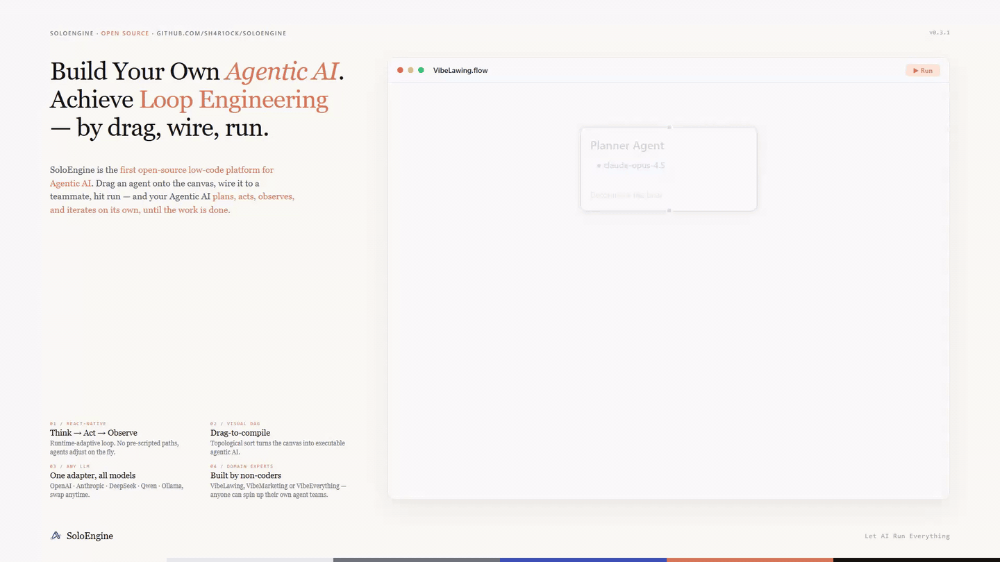
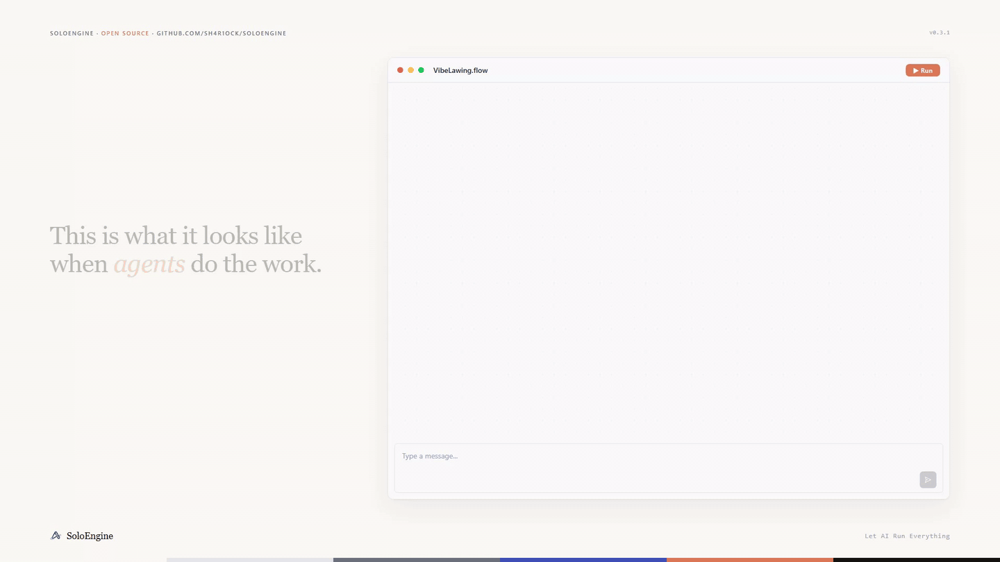

<div align="center">


</div>

***

<h2 align="center"><b>KI treibt jede Branche an.</b></h2>

***

<p align="center"><b>SoloEngine</b> ist die erste Low-Code-Plattform für Agentic AI. Ziehen Sie einen Agent auf die Arbeitsfläche, verbinden Sie ihn mit einem weiteren Teammitglied und starten Sie ihn – er plant, handelt, beobachtet und iteriert selbstständig, bis die Aufgabe erledigt ist.</p>

<p align="center">No Workflow. No orchestration code. Just Agents that get things done.</p>

<div align="center">

[](https://github.com/Sh4r1ock/SoloEngine)
[](https://www.python.org/)
[](https://fastapi.tiangolo.com/)
[](https://reactjs.org/)
[](https://www.typescriptlang.org/)
[](./LICENSE)
[](https://zread.ai/Sh4r1ock/SoloEngine)

</div>

<p align="center">
  <a href="../../README.md">English</a> |
  <a href="./README_ZH.md">简体中文</a> |
  <a href="./README_ES.md">Español</a> |
  Deutsch |
  <a href="./README_FR.md">Français</a>
</p>

***

## Warum SoloEngine

Agentic AI verändert die Softwareentwicklung grundlegend: Ein einzelner Entwickler liefert heute, wofür früher ein Zehnerteam nötig war. Doch diese Revolution blieb bislang auf die IDE beschränkt. Um einen wirklich autonomen AI-Agenten zu bauen, musste man LangChain-Pipelines von Hand schreiben, ReAct-Loops debuggen und Tool-Schemas einzeln definieren. Wer nicht programmieren kann, stand vor einer Wand.

Die verfügbaren Alternativen lösen das Problem kaum: Workflow-Plattformen (Dify, n8n, Zapier u. a.) folgen starr vordefinierten Pfaden — ihr Kern ist kein autonomer Agent. Code-Frameworks (LangChain, CrewAI, LangGraph u. a.) setzen zwingend Python-Kenntnisse voraus. **SoloEngine** schließt genau diese Lücke.

<div align="center">

|              <br />             |      Dify, n8n, Zapier      | LangChain, CrewAI, LangGraph |      **SoloEngine**      |
| :-----------------------------: | :-------------------------: | :--------------------------: | :----------------------: |
|            Agentic AI           | ✗ Nur geskriptete Workflows |     ✓ ReAct / Multi-Agent    |   ✓ ReAct / Multi-Agent  |
|       Ohne Programmierung       |              ✓              |   ✗ Python-Kenntnisse nötig  |             ✓            |
|     Visuelle Orchestrierung     |   ✓ Volle Canvas-Erfahrung  |               ✗              | ✓ Volle Canvas-Erfahrung |
| Fachexperten bauen eigenständig |              ✓              |               ✗              |             ✓            |
|    Multi-Agent-Kollaboration    |              ✗              |               ✓              |             ✓            |

</div>

- **Kill WorkFlow** — SoloEngine basiert vollständig auf der ReAct-Architektur und verzichtet auf vordefinierte Abläufe. Stattdessen gilt der Zyklus „Denken → Handeln → Beobachten → Wiederholen". Jede Entscheidung fällt dynamisch zur Laufzeit. Stößt ein Agent auf eine unerwartete Hürde, passt er seinen Plan automatisch an — ohne hartcodierte Fallback-Pfade.
- **Fachexperten bauen direkt** — Ein Anwalt zieht einen Vertragsprüfungs-Agenten auf die Arbeitsfläche, verbindet ihn mit einem Recherche-Agenten und startet. Kein Entwickler nötig.
- **Tools, Skills, MCP — Hot-Plugging & Progressive Disclosure** — Jeder Agent lädt zur Laufzeit nur die Werkzeuge und Skills, die er tatsächlich benötigt. Dank Progressive Disclosure sinkt der Token-Verbrauch um über 85 %.
- **Eine Adapterschicht für alle Modelle** — OpenAI, Anthropic, Ollama, DeepSeek, Tongyi Qianwen, Zhipu — einheitliche Schnittstelle, nahtloser Wechsel.

### So funktioniert es

Alle Agents teilen sich dieselbe zugrunde liegende Architektur; sie unterscheiden sich nur in ihrer Konfiguration. Das visuelle Design auf der Arbeitsfläche wird kompiliert und direkt in ein ausführbares Agentic AI überführt.

1. **Kompilierung** — Das visuelle Layout wird per topologischer Sortierung in einen gerichteten azyklischen Graphen (DAG) der Agents überführt. Ein und derselbe Compiler erzeugt beliebig viele Teamkonstellationen.
2. **Einheitliche ReAct-Engine** — Jeder Agent durchläuft denselben Zyklus: „Denken → Handeln → Beobachten → Wiederholen".
3. **Bedarfsgerechtes Laden** — Dank des Kompilierungsmechanismus laden Agents zur Laufzeit nur den konfigurierten Modell, die Inhalte und Werkzeuge. Das macht Agentic AI in einer Low-Code-Umgebung überhaupt erst praktisch umsetzbar.

<div align="center">
  
  <p><sub>Agents auf dem visuellen Canvas zusammenstellen und die Teamkonfiguration in einen ausführbaren Agent DAG kompilieren</sub></p>
</div>

## Schnellstart

```bash
git clone https://github.com/Sh4r1ock/SoloEngine.git
cd SoloEngine

# Backend (Python 3.11+)
cd backend
pip install -r requirements.txt
python main.py

# Frontend (Node.js 18+) — in einem zweiten Terminal ausführen
cd frontend 
npm install
npm run dev
```

Öffne **<http://localhost:8991>** im Browser und baue dein erstes Agent-Team.

## Anwendungsszenarien

- **VibeLawing** — Ein Anwalt zieht nacheinander einen Recherche-Agenten, einen Archivierungs-Agenten und einen Formatierungs-Agenten auf die Arbeitsfläche und startet. SoloEngine zerlegt und plant die juristische Arbeit automatisch: Sachverhalte werden analysiert, Gesetzestexte ermittelt, Fälle aufbereitet, Argumentationen strukturiert und Dokumente formatiert — Sie müssen nur noch prüfen und gegebenenfalls nachjustieren, bevor Sie abliefern. Der gesamte Ablauf verläuft so natürlich, als würde ein Entwickler in Cursor vibe coding betreiben.
- **VibeMarketing** — Eine Marketingfachkraft zieht einen Recherche-Agenten, einen Texter-Agenten und einen Asset-Agenten auf die Arbeitsfläche und startet. SoloEngine analysiert automatisch die Zielgruppe, recherchiert passende Produktstrategien, vergleicht mit der Wettbewerb und erstellt eine Marketingstrategie — das Ergebnis ist ein ausgereifter Marketingplan, direkt zur Übergabe bereit.
- **Ein-Klick-Paketierung** — Sobald das Agent-Team steht, genügt ein Klick auf „Paketieren", um ein vollständiges Produkt auszugeben, das jeder sofort nutzen kann.

<div align="center">
  
  <p><sub>Planung, Aktionen, Tool-Aufrufe und Iterationen von Agents im RunPanel in Echtzeit verfolgen</sub></p>
</div>

## Star-Verlauf

[](https://www.star-history.com/?repos=Sh4r1ock%2FSoloEngine&type=date&legend=top-left)

<p align="center">⭐ <b>Wenn dir SoloEngine gefällt, gib uns einen Stern — jeder einzelne zählt!</b></p>

## Danksagung

Besonderer Dank an:

<p align="center">
  <a href="https://github.com/XiaomiMiMo"></a>
</p>

## Mitwirken

<p align="center">Wir freuen uns auf deinen Beitrag.</p>

<p align="center">Ob eine korrigierte Schreibweise, ein neues Tool-Plugin, eine überarbeitete Dokumentation oder ein vollständiges Feature — jeder Beitrag macht SoloEngine besser. Pull Requests jeder Größe sind willkommen.</p>

<p align="center">📝 <a href="../../CONTRIBUTING.md">Contribution Guide</a> &nbsp;·&nbsp; 🐛 <a href="https://github.com/Sh4r1ock/SoloEngine/issues?q=is%3Aissue+is%3Aopen+label%3A%22good+first+issue%22">Gute erste Issues</a> &nbsp;·&nbsp; 📧 <a href="mailto:sh4r1ock@qq.com">sh4r1ock@qq.com</a></p>

## Lizenz

<p align="center">Apache License 2.0. Details unter <a href="../../LICENSE">LICENSE</a>.</p>

***

<div align="center">

**SoloEngine — AI for Every Industry ❤️**

</div>
